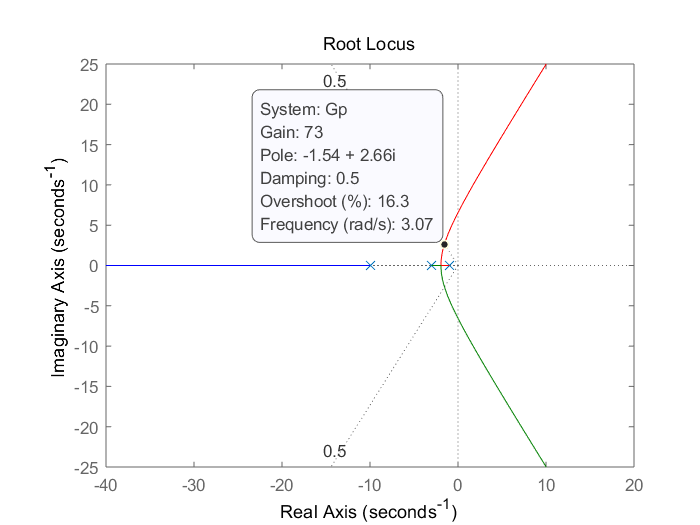

# problem 1

$G(s)=\frac{K}{(s+1)(s+3)(s+10)}$ for $\xi=0.5$

## Uncompensated

First, I draw the root locus of G(s) to find the uncompensated gain K.

```matlab
s = tf('s');
Gp = 1/(s+1)/(s+3)/(s+10);
figure();
rlocus(Gp);
sgrid(0.5,100);
```



From the figure, I find the operating point with  $\xi=0.5$, K = 73 and %OS = 16.3.

Then I draw the step response for K = 73

```matlab
K = 73;
Gp = K*Gp;
figure();
step(feedback(Gp,1))
```


Thus, the specifications of uncompensated system are shoId above.

## Compensated

Secondly, I design a PI controller $Gc=\frac{s+0.01}{s}$, then find the corresponding gain K.

```matlab
Gp = 1/(s+1)/(s+3)/(s+10);
Gc = (s+0.01)/s;
G = Gc*Gp;
figure();
rlocus(Gp);
sgrid(0.5,100);
```


From the figure, I find the operating point with  $\xi=0.5$, K = 56.6 and %OS = 16.2

Then I draw the step response for K = 56.6

```matlab
K = 56.6;
figure();
G = K*G;
step(feedback(G,1));
```


Thus, the specifications of uncompensated system are shoId above.

# problem 5

$G(s)=\frac{K}{(s+3)(s+5)(s+7)}$ for $\%OS = 10$

## (a)
First, I draw the root locus to find the cooresponding $\xi$ and gain K.

```matlab
s = tf('s');
Gp = 1/(s+3)/(s+5)/(s+7);
figure();
rlocus(Gp)
```


From the figure, I find the operating point for %OS = 10.1%, with  $\xi=0.589$ and $K = 88.3$

$$
\begin{aligned}  
K_{p0}&=\lim_{s\rightarrow0}G(s)\\&=\frac{88.3}{3\times5\times7}\\
&= 0.8410
\end{aligned}
$$

In order to yeild $K_p=20$ without changing the dominant pole location, I set
$$
\begin{aligned}
&K = \frac{20}{K_{p0}}
=23.7825
\\&G_c(s)=\frac{s+K\times0.001}{s+0.001}

\end{aligned}
$$

## (b)

```matlab
K = 88.3;
Gp = Gp*K;
figure();
step(feedback(Gp,1));
```


```matlab
Kp = 23.7825;
Gc = (s+Kp*0.001)/(s+0.001);
G = Gc*Gp;
figure();
step(feedback(G,1));
```


## (c)

The settling time is 285s.

# problem 6

$G(s)=\frac{K(s+6)}{(s+2)(s+3)(s+5)}$ for $\xi = 0.707$

First, draw the root locus

```matlab
Gp = (s+6)/(s+2)/(s+3)/(s+5);
figure();
rlocus(Gp);
sgrid(0.707,100);
```


The operating point is -2.32 + 2.32i with gain $K=4.59$

Since the settling time should be reduced by half while $\xi$ remain the same, the new operating point should be -4.64 + 4.64i

By trigonometry, $G_c=s+7.21$

```matlab
K = 4.59;
Gp = K*Gp;
Gc = s+7.21;
G = Gc*Gp;
figure();
subplot(211);
step(feedback(Gp,1));
subplot(212);
step(feedback(G,1));
```


From the figure, both transient and steady-state performance is improved, while the settling time is reduced more than half, cause by second-order approximation.

# problem 9

## (a)

```matlab
OS = 25;
xi = -log(OS/100)/sqrt(pi^2+log(OS/100)^2);
Ts = 1.6;
omega = 4/(xi*Ts);
```

The expected operating point is $-2.50\pm5.67j$

## (b)

```matlab
anglePc = 180+(180-atand(5.6655/(2.5-1))-3*atand(5.6655/(4-2.5)));
```

The angular contribution of the compensator pole is $59.32^\circ$

## (c)

```matlab
Pc = 5.6655/tand(anglePc)+2.5;
```

$p_c=5.86$

## (d)

```matlab
Gc = (s+Zc)/(s+Pc);
G = Gc*Gp;
figure();
rlocus(G);
sgrid(xi,[]);
```


Thus, $K=226$

## (e)

```matlab
K = 226;
G = K*G;
figure();
pzmap(feedback(G,1));
```


## (f)

Pole at -11.5 is 4.6 times further from the imaginary axis than the dominant poles. Pole at -1.36 may not cancel the zero at -1.

## (g)

```matlab
figure();
step(feedback(G,1));
```


From the figure, the requirements of both persent overshoot and settling time are not met, due to an inapproperiate second-order approximation.
