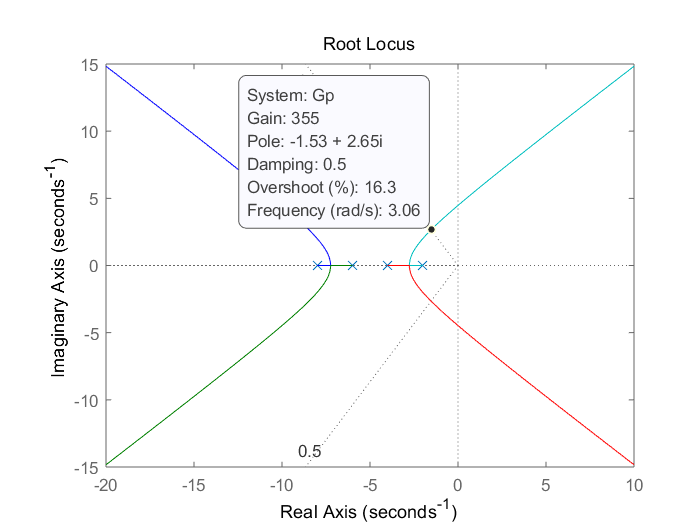
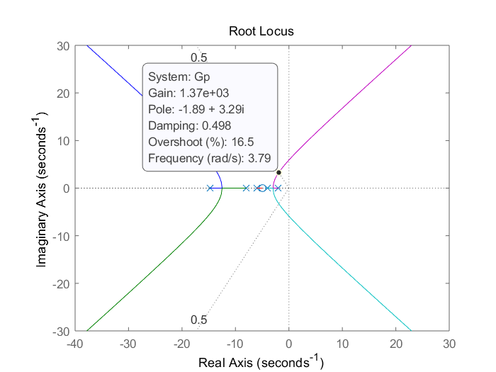
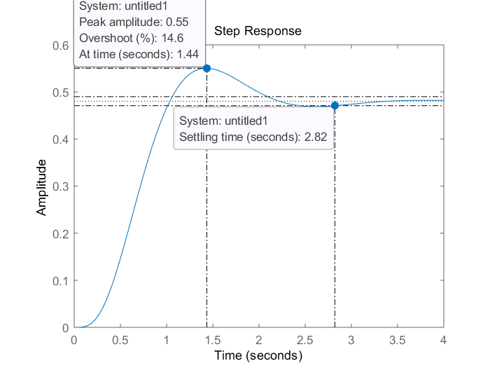
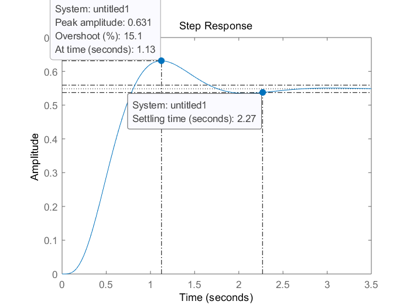
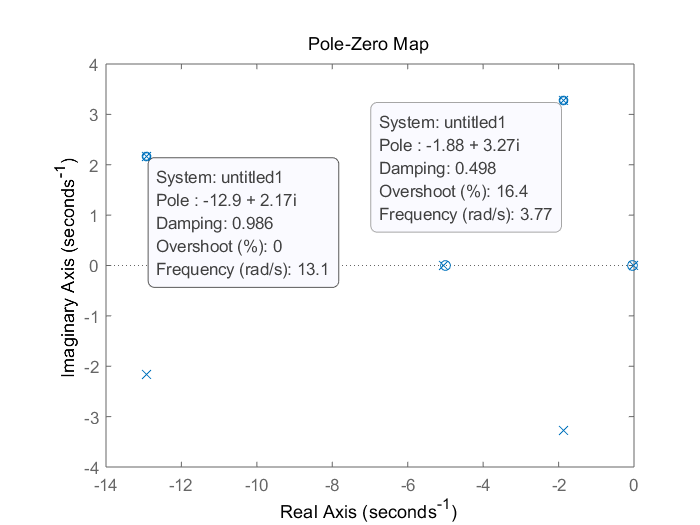
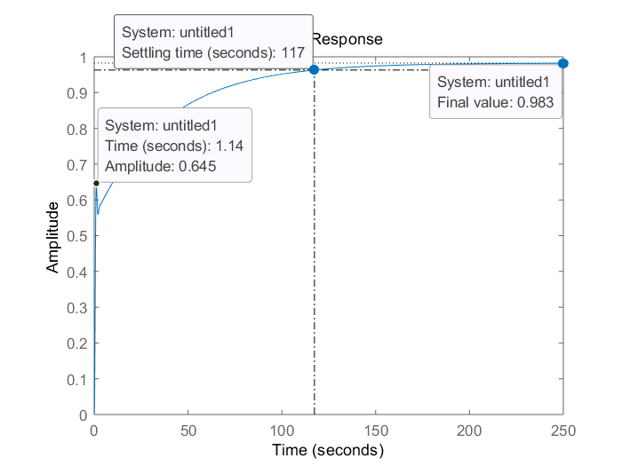
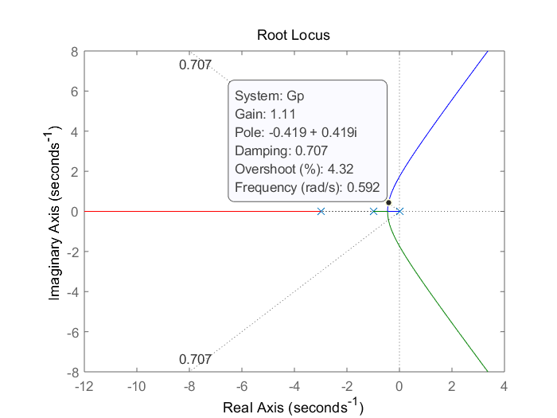
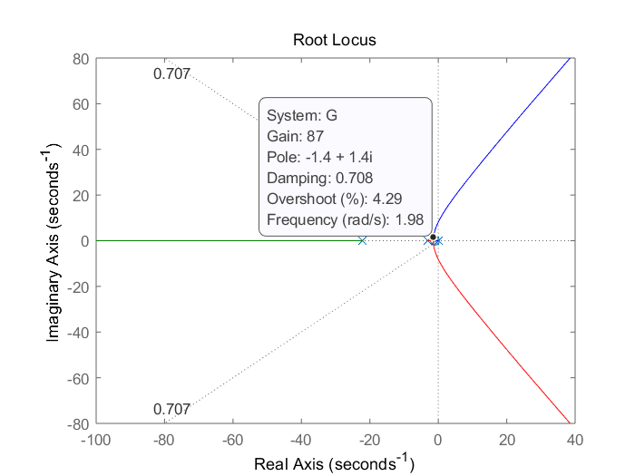
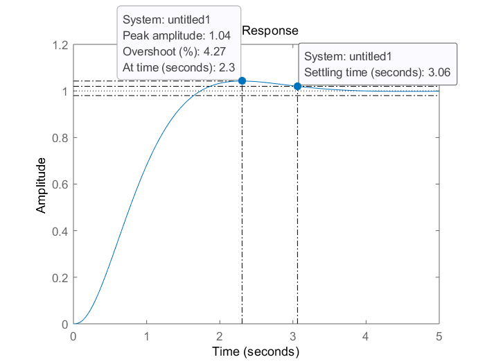

# HW14

## problem 19

$G=\frac{K}{(s+2)(s+4)(s+6)(s+8)}$

### 1.Unconpensated system

```matlab
s = tf('s');
Gp = 1/(s+2)/(s+4)/(s+6)/(s+8);
rlocus(Gp);
sgrid(0.5,[]);
```



From the figures, the characters of it are:
$$
Ts = \frac{4}{1.53}=2.6144
$$

### Lead compensator design

For the specifications, the new operating point is:

$$
\begin{aligned}
&\sigma_d'=\frac{4}{Ts-0.5}\\
&\omega_d'=\sigma_d'\times\frac{\sqrt{1-\zeta^2}}{\zeta}\\
&-\sigma_d'\plusmn j\omega_d=-1.8921\plusmn3.2773
\end{aligned}
$$

Set a compensator zero at -5, the angular contribution of the current open loop poles and zeros is:

$$
\begin{aligned}
\Sigma\theta&=\Sigma \angle zero+\Sigma \angle pole
\\&=-165.6472
\end{aligned}
$$

Thus the position of compensator pole is:
$$
\begin{aligned}
&\arctan\frac{\omega_d'}{p_c-\sigma_d'}=180+\Sigma\theta\\
\Rightarrow &p_c=14.7002
\end{aligned}
$$

```matlab
Gp = Gp*(s+5)/(s+14.7002);
rlocus(Gp);
sgrid(0.5,[]);
```



The lead compensator:
$$
G_{Lead}=\frac{1370 (s+5)}{s+14.7002}
$$

```matlab
Gp = 1/(s+2)/(s+4)/(s+6)/(s+8);
figure();
step(feedback(355*Gp,1));
G1 = 1370*(s+5)/(s+14.7002)/(s+2)/(s+4)/(s+6)/(s+8);
figure();
step(feedback(G1,1));
```




The simulation shows that the settling time is reduced by 0.55s, and the overshoot(\%) is maintained about 15.

### Lag compensator design

$$
\begin{aligned}  
&K_{p}=\lim_{s\rightarrow0}G(s)=\frac{355}{2\times4\times6\times8}= 0.9245\\
&e(\infin)=\frac{1}{K_p+1}=0.5196\\
&e(\infin)'=\frac{e(\infin)}{30}=0.0173\\
&K_p'=\frac{1}{e(\infin)'}-1=56.7344\\
&K_{Lag}=K_p'/\frac{K_p\times1370\times5}{355\times14.7002}=46.7531\\
\Rightarrow&G_{Lag}=\frac{s+0.0467531}{s+0.001}\\
\end{aligned}
$$

$$
\begin{aligned}
G_c&= G_{Lead}*G_{Lag}\\
&=\frac{1370(s+5)(s+0.0467531)}{(s+14.7002)(s+0.001)}
\end{aligned}
$$

```matlab
G2 = G1*(s+0.0467531)/(s+0.001);
figure;
pzmap(feedback(G2,1));

```



From the pole-zero map, it's obvious that the dominant poles are the desired ones, the compensator's poles and zeros cancel each other and poles at -12.9 are 5 times futher than the dominant poles.

### System verify

$$
G=\frac{G_c}{(s+2)(s+4)(s+6)(s+8)}
$$

```matlab
figure;
step(feedback(G2,1));
```



Simulation shows that the specification of steady-state error is met but the settling time isn't.

Since the uncompensated system is a 0 type system, the modified transient response doesn't rise with the steady-state response.

## problem 21

$G=\frac{K}{s(s+1)(s+3)}$

### (a)

Since the requirement is about transient response, a lead compensator is needed.

$$
\begin{aligned}
&\zeta=\frac{-ln(\%OS/100)}{\sqrt{\pi^2+ln(\%OS/100)^2}}=0.7071\\
&\sigma_d=\frac{4}{Ts}=1.3986\\
&\omega_d=\sigma_d\times\frac{\sqrt{1-\zeta^2}}{\zeta}=1.3985\\
&-\sigma_d\plusmn\omega_d=-1.4\plusmn j1.4
\end{aligned}

$$

```matlab
Gp = 1/s/(s+1)/(s+3);
OS = 4.32;
zeta = -log(OS/100)/sqrt(pi^2+log(OS/100)^2);
rlocus(Gp);
sgrid(zeta,[]);
```



From the figure, the operating point is out of the root locus, thus I put a zero at -1 to cancel the pole at -1.Then calculate the pole location from the current poles and zeros angular contribution.

```matlab
Ts = 2.86;
sigma = 4/Ts;
omega = sigma/zeta*sqrt(1-zeta^2);
zc = 1;
angContri = (180-atan2d(omega,(sigma-1)))...
    -(180-atan2d(omega,(sigma-0)))...
    -(180-atan2d(omega,(sigma-1)))...
    -atan2d(omega,(3-sigma));
angPole = -180-angContri;
pc = sigma-omega/tand(180+angPole);
Gc = (s+zc)/(s+pc);
G = Gp*Gc;
figure();
rlocus(G);
sgrid(zeta,[]);
figure();
step(feedback(87*G,1));
```

$$
G_c=\frac{s+1}{s+22.0863}
$$





$$
\begin{aligned}
&Kv=\frac{1.11}{3}=0.37\\
&Kv'=Kv*\frac{1}{22.0863}=1.4575\\
\Rightarrow &K_v'>2K_v
\end{aligned}
$$
